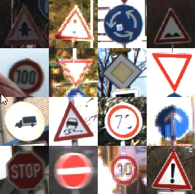

# Traffic Sign Recognizer

A deep learning model that learns to recognize traffic signs.

## Overview

The full code can be found in this [IPython Notebook.](https://github.com/wolfgang-stefani/Traffic-Sign-Classifier/blob/main/Traffic_Sign_Classifier.ipynb)

This program uses a deep neural network with several convolutional layers to classify traffic signs. The model is able to recognize traffic signs with an accuracy of 96,2%. It was trained and validated with images from the [German Traffic Sign Dataset](http://benchmark.ini.rub.de/?section=gtsrb&subsection=dataset) with 43 classes and more than 50,000 images in total.

The pickled dataset contains a training, validation and test set. The images are resized to 32x32.

The steps are the following:
* Step 0: Load The Data
* Step 1: Dataset Summary & Visualization
  * Summary of the original dataset
  * Visualization of the original dataset
  * Data Augmentation
  * Basic Summary of the augmented dataset
  * Data preprocessing
* Step 2: Design a Model Architecture (Deep Learning model)
* Step 3: Train and Evaluate the Deep Learning model
  * Tuning hyperparameters
  * Features and Labels
  * Training pipeline
  * Evaluation pipeline
  * Train and validate the model
* Step 4: Use the model to make predictions on new images found on the web
  * Load and Output the Images
  * Predict the Sign Type for Each Image
  * Analyze Performance
  * Analyze the softmax probabilities (output Top 5 Softmax Probabilities) for each image found on the web
---

### Data Set Summary & Visualization

#### 1. Summary of the original dataset

* The size of training set is 34,799.
* The size of the validation set is 4,410.
* The size of the test set is 12,630.
* The shape of a traffic sign image is (32, 32, 3)
* The number of unique classes/labels in the dataset is 43.

#### 2. Visualization of the original dataset

Here is an exploratory visualization of the German Traffic Signs dataset. 

First, a bar chart showing how the training samples are distributed across the classes:

![alt text][image1]

Some classes are highly **underrepresented**. Some only have 200 samples or even less, which is not enough for most of the models to perform well. The training samples are also fairly unbalanced which means some classes are represented to significantly lower extent than others. This will be fixed with **Data augmentation** (next rubric).

Additionally to the bar char chart above, for each class (type of traffic sign) 10 random images are plotted. As an example, here you can see two classes:

![alt text][image9]

#### 3. Data augmentation

Augmenting the training set (=generating additional data) helps improving the model. It makes the model more robust to slight variations, and hence prevents the model from overfitting.
Augmenting techniques are "cheap tricks" because no additional data needs to be collected. Only a small amount of additional computing resources is needed for improving the performance significantly.

Augmentation techniques can be Flipping, translation, scaling (zoom), rotation and many more. To add more data to the the dataset, I used the rotation technique because it is quite simple to implement but triples the amount of data in my solution. 

##### Flipping

Flipping is another augmentation technique, which was not implemented but illustrates well the general method of augmenting. Signs like "Ahead Only" are horizontally and/or vertically symmetrical. These can be simply flipped, which would allow us to get twice as much data for these classes.

Other signs like "Turn right ahead" and "Turn left ahead" are some kind of interchageable pairs. These can in a first step be flipped and then be assigned to the corresponding, pairing class. In this case the number of samples could be increased by a factor of around 4.

##### Translation, scaling (zoom) and rotation

CNNs have built-in invariance to small translations, scaling and rotations. The training doesn't contain such mutations, so we will add those. In this project we implement rotation. To demonstrate visually what rotation means, here is an example of an random original image and its augmented counterparts:

![alt text][image10]

Each image from the training set has been rotated like this resulting in a 3x wider training set:

* The size of the new, augmented training set is 104,397.

#### 4. Data Preprocessing

Preprocessing refers to techniques such as converting to grayscale, normalization, etc.

##### Normalizing
As a first step, the images are being normalized so that the data has mean zero and equal variance. Normalizing helps the network to converge faster. It makes it a lot easier for the optimizer to proceed numerically:

![alt text][image11]

For image data, `(pixel - 128)/ 128` is a quick way to approximately normalize the data. It doesn't change the content of the images:

![alt text][image12]

#### Grayscaling (single-channel images)
As a second step, I grayscaled the image data because using color channels didn't seem to improve things a lot as Pierre Sermanet and Yann LeCun mentioned in [their paper](http://yann.lecun.com/exdb/publis/pdf/sermanet-ijcnn-11.pdf).

Here is an example of a traffic sign image before and after grayscaling.

![alt text][image2]

---

### Model Architecture (Deep Learning model)

As a starting point, I decided to use a convolutional neural network architecture known as LeNet-5 (similarly implemented in [Pierre Sermanet's / Yann LeCun's paper](http://yann.lecun.com/exdb/publis/pdf/sermanet-ijcnn-11.pdf)). LeNet-5 consists of 6 layers (C1, S2, C3, S4, C5, F6). Here, you do not count input and output as a layer:

![alt text][image13]

A problem with this initial architecture is overfitting - a high accuracy on the training set but low accuracy on the validation set.

After an iterative approach consisting of several steps of testing different layers and hyperparameters, my convolutional neural network classifier consists of 8 layers: **3 convolutional layers**, **3 subsampling/pooling layers** and **2 fully connected layers**:

![alt text][image14]

In comparison to LeNet, the **learning rate** is reduced from 0,001 to 0,0005. A higher learning rate does not mean to learn more and faster. In fact you get to a better model with low loss faster with a low learning rate.
**Epochs** are changed from 10 to 50. An epoch is a single pass of the whole dataset through the model used to increase the accuracy of the model without requiring more data. It is important to chose a suitable number of epochs.

For reducing overfitting, the regularization technique dropout is implemented with `keep_prob` set to 0,7. 

The code of the model can be found in the [project's IPython notebook](https://github.com/udacity/CarND-Traffic-Sign-Classifier-Project/blob/master/Traffic_Sign_Classifier.ipynb) in the first cell right under the headline "Step 2: Design a Model Architecture (Deep Learning model)".

The results of the final model are:
* validation set accuracy of 98,1%
* test set accuracy of 96,2%
* (training set accuracy of 99,9%)

### Test the Model on New Images

#### 1. Five German traffic signs found on the web

Here are five German traffic signs that I found on the web:

![alt text][image4] ![alt text][image5] ![alt text][image6] 
![alt text][image7] ![alt text][image8]

The first image might be difficult to classify because the environment is very restless and part of a round sign can be seen at the lower end.
Second and third image are quite clear but have two stickers that do not belong there and could make classification difficult.
The fourth traffic sign ("right-of-way at the next intersection") has large bullet holes and the paint is peeling off. That could seriously affect the forecast.
The last traffic sign is clearly visible and should be  recognizable without any issues.

#### 2. Model's predictions on these new traffic signs

Here are the results of the prediction:

| Image			        |     Prediction	        					| 
|:---------------------:|:---------------------------------------------:| 
| Road Work      		| Road Work   									| 
| Yield     			| Yield 										|
| Priority Road					| Priority Road											|
| Right-of-way at next intersection	      		| Priority Road					 				|
| Speed limit 30 km/h			| Speed limit 30 km/h      							|

The model was able to correctly classify 4 of the 5 traffic signs, which gives an accuracy of 80%. This compares favorably to the accuracy on the test set of 95,6%. The difference of 15,6% is not meaningful. It's only because one incorrectly classified out of five images in total worsens the accuracy by 20%.

#### 3. Model's certainty (top 5 softmax probabilities for each image along with the sign type of each probability)

The code for making predictions on my final model is located in the third last cell of the Ipython notebook when "evaluate(X_custom, y_custom)" is called. The results can be printed out readable using [`tf.nn.top_k`](https://www.tensorflow.org/versions/r0.12/api_docs/python/nn.html#top_k): 

For each of the new images, the model's softmax probabilities are printed out to show the **certainty** of the model's predictions.

`tf.nn.top_k` returns the values and indices (class IDs) of the top k predictions. So if k=5, it'll return the 5 largest probabilities (out of a possible 43) and the corresponding class IDs for each sign.

The top five soft max probabilities were:

| Probability         	|     Prediction	        					| 
|:---------------------:|:---------------------------------------------:| 
| 1.0         			| Road work   									| 
| 1.0     				| Yield 										|
| 1.0					| Priority Road											|
| 99.19	      			| Priority Road					 				|
| 1.0				    | Speed limit 30 km/h      							|

The model has 100% certainty for all images but the the "right-of-way at next intersection" which indeed was incorrectly classified as a "priority road" sign which is not the same. Let's have a closer look on the top 5 softmax probabilities of the incorrectly classified traffic sign:

| Probability (top-down)        	|     Prediction	        					| 
|:---------------------:|:---------------------------------------------:| 
| 99.1975844         			| Priority road   									| 
| 0.0074162608     				| Right-of-way at the next intersection 										|
| 0.0006079752					| Beware of ice/snow											|
| 0.0000000102	      			| Traffic signals					 				|
| 0.0000000006				    | Roundabout mandatory     							|

The model is quite certain, namely with 99.19% certainty that the image shows a "priority road" sign. As a human we can definitely say this is wrong. From this we learn that a probability below 100% always needs to be questioned - even if it is very close to 100%.

[//]: # (Image References)

[image1]: ./examples/visualization.jpg "Visualization"
[image2]: ./examples/grayscale.jpg "Grayscaling"
[image3]: ./examples/random_noise.jpg "Random Noise"
[image4]: ./examples/web/example_00001.png "Road work"
[image5]: ./examples/web/example_00002.png "Yield"
[image6]: ./examples/web/example_00003.png "Priority road"
[image7]: ./examples/web/example_00004.png "Right-of-way at the next intersection"
[image8]: ./examples/web/example_00005.png "Speed limit 30 km/h"
[image9]: ./examples/two_classes.jpg "Two Classes"
[image10]: ./examples/rotation.jpg "Rotation"
[image11]: ./examples/Normalized_problem.jpg "Normalized Inputs"
[image12]: ./examples/Normalizing_images.jpg "Normalizing Images"
[image13]: ./examples/LeNet-5.png "LeNet-5.png"
[image14]: ./examples/convnet.jpg "Convnet"
