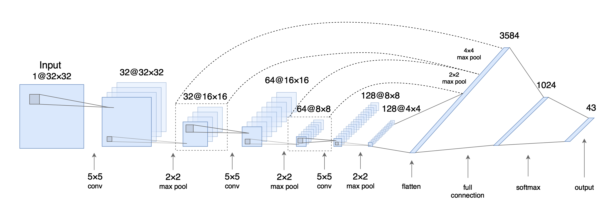

# Traffic Sign Recognition Program

A deep learning model that learns to recognize traffic signs.

## Overview

This program uses deep neural networks and convolutional neural networks to classify traffic signs. The model is able to classify traffic sign images and was trained and validated using the [German Traffic Sign Dataset](http://benchmark.ini.rub.de/?section=gtsrb&subsection=dataset) with 43 classes and more than 40,000 images in total.
The pickled dataset contains a training, validation and test set. The images are resized to 32x32.

Here is a link to the [project code](https://github.com/udacity/CarND-Traffic-Sign-Classifier-Project/blob/master/Traffic_Sign_Classifier.ipynb)

The steps are the following:
* Step 0: Load The Data
* Step 1: Dataset Summary & Visualization
  * Summary of the original dataset
  * Visualization of the original dataset
  * Data Augmentation
  * Basic Summary of the augmented dataset
  * Data preprocessing
* Step 2: Design a Model Architecture (Deep Learning model)
* Step 3: Train and Evaluate the Deep Learning model
  * Tuning hyperparameters
  * Features and Labels
  * Training pipeline
  * Evaluation pipeline
  * Train and validate the model
* Step 4: Use the model to make predictions on new images found on the web
  * Load and Output the Images
  * Predict the Sign Type for Each Image
  * Analyze Performance
  * Analyze the softmax probabilities (output Top 5 Softmax Probabilities) for each image found on the web
---

### Data Set Summary & Visualization

#### 1. Summary of the original dataset

* The size of training set is 34,799.
* The size of the validation set is 4,410.
* The size of the test set is 12,630.
* The shape of a traffic sign image is (32, 32, 3)
* The number of unique classes/labels in the dataset is 43.

#### 2. Visualization of the original dataset

Here is an exploratory visualization of the German Traffic Signs dataset. It is a bar chart showing how the data is distributed across the classes.

![alt text][image1]

Each class (type of traffic sign) is checked, counting its number of samples and plotting 10 random images. As an example, here you can see two classes:

![alt texthehe][image9]

### Model Architecture (Deep Learning model)

I decided to use a deep neural network classifier as a model, which was aforementioned in [Pierre Sermanet's / Yann LeCun's paper](http://yann.lecun.com/exdb/publis/pdf/sermanet-ijcnn-11.pdf). It has __ layers: **__ convolutional layers** for feature extraction and **__ fully connected layer** as a classifier.

  

#### 1. Describe how you preprocessed the image data. What techniques were chosen and why did you choose these techniques? Consider including images showing the output of each preprocessing technique. Pre-processing refers to techniques such as converting to grayscale, normalization, etc. (OPTIONAL: As described in the "Stand Out Suggestions" part of the rubric, if you generated additional data for training, describe why you decided to generate additional data, how you generated the data, and provide example images of the additional data. Then describe the characteristics of the augmented training set like number of images in the set, number of images for each class, etc.)

As a first step, I decided to convert the images to grayscale because ...

Here is an example of a traffic sign image before and after grayscaling.

![alt text][image2]

As a last step, I normalized the image data because ...

I decided to generate additional data because ... 

To add more data to the the data set, I used the following techniques because ... 

Here is an example of an original image and an augmented image:

![alt text][image3]

The difference between the original data set and the augmented data set is the following ... 

#### 2. Describe what your final model architecture looks like including model type, layers, layer sizes, connectivity, etc.) Consider including a diagram and/or table describing the final model.

My final model consisted of the following layers:

| Layer         		|     Description	        					| 
|:---------------------:|:---------------------------------------------:| 
| Input         		| 32x32x3 RGB image   							| 
| Convolution 3x3     	| 1x1 stride, same padding, outputs 32x32x64 	|
| RELU					|												|
| Max pooling	      	| 2x2 stride,  outputs 16x16x64 				|
| Convolution 3x3	    | etc.      									|
| Fully connected		| etc.        									|
| Softmax				| etc.        									|
|						|												|
|						|												|
 

#### 3. Describe how you trained your model. The discussion can include the type of optimizer, the batch size, number of epochs and any hyperparameters such as learning rate.

To train the model, I used an ....

#### 4. Describe the approach taken for finding a solution and getting the validation set accuracy to be at least 0.93. Include in the discussion the results on the training, validation and test sets and where in the code these were calculated. Your approach may have been an iterative process, in which case, outline the steps you took to get to the final solution and why you chose those steps. Perhaps your solution involved an already well known implementation or architecture. In this case, discuss why you think the architecture is suitable for the current problem.

My final model results were:
* training set accuracy of ?
* validation set accuracy of ? 
* test set accuracy of ?

If an iterative approach was chosen:
* What was the first architecture that was tried and why was it chosen?
* What were some problems with the initial architecture?
* How was the architecture adjusted and why was it adjusted? Typical adjustments could include choosing a different model architecture, adding or taking away layers (pooling, dropout, convolution, etc), using an activation function or changing the activation function. One common justification for adjusting an architecture would be due to overfitting or underfitting. A high accuracy on the training set but low accuracy on the validation set indicates over fitting; a low accuracy on both sets indicates under fitting.
* Which parameters were tuned? How were they adjusted and why?
* What are some of the important design choices and why were they chosen? For example, why might a convolution layer work well with this problem? How might a dropout layer help with creating a successful model?

If a well known architecture was chosen:
* What architecture was chosen?
* Why did you believe it would be relevant to the traffic sign application?
* How does the final model's accuracy on the training, validation and test set provide evidence that the model is working well?
 

### Test a Model on New Images

#### 1. Choose five German traffic signs found on the web and provide them in the report. For each image, discuss what quality or qualities might be difficult to classify.

Here are five German traffic signs that I found on the web:

![alt text][image4] ![alt text][image5] ![alt text][image6] 
![alt text][image7] ![alt text][image8]

The first image might be difficult to classify because ...

#### 2. Discuss the model's predictions on these new traffic signs and compare the results to predicting on the test set. At a minimum, discuss what the predictions were, the accuracy on these new predictions, and compare the accuracy to the accuracy on the test set (OPTIONAL: Discuss the results in more detail as described in the "Stand Out Suggestions" part of the rubric).

Here are the results of the prediction:

| Image			        |     Prediction	        					| 
|:---------------------:|:---------------------------------------------:| 
| Stop Sign      		| Stop sign   									| 
| U-turn     			| U-turn 										|
| Yield					| Yield											|
| 100 km/h	      		| Bumpy Road					 				|
| Slippery Road			| Slippery Road      							|

The model was able to correctly guess 4 of the 5 traffic signs, which gives an accuracy of 80%. This compares favorably to the accuracy on the test set of ...

#### 3. Describe how certain the model is when predicting on each of the five new images by looking at the softmax probabilities for each prediction. Provide the top 5 softmax probabilities for each image along with the sign type of each probability. (OPTIONAL: as described in the "Stand Out Suggestions" part of the rubric, visualizations can also be provided such as bar charts)

The code for making predictions on my final model is located in the 11th cell of the Ipython notebook.

For the first image, the model is relatively sure that this is a stop sign (probability of 0.6), and the image does contain a stop sign. The top five soft max probabilities were

| Probability         	|     Prediction	        					| 
|:---------------------:|:---------------------------------------------:| 
| .60         			| Stop sign   									| 
| .20     				| U-turn 										|
| .05					| Yield											|
| .04	      			| Bumpy Road					 				|
| .01				    | Slippery Road      							|

For the second image ... 

### (Optional) Visualizing the Neural Network (See Step 4 of the Ipython notebook for more details)
#### 1. Discuss the visual output of your trained network's feature maps. What characteristics did the neural network use to make classifications?

[//]: # (Image References)

[image1]: ./examples/visualization.jpg "Visualization"
[image2]: ./examples/grayscale.jpg "Grayscaling"
[image3]: ./examples/random_noise.jpg "Random Noise"
[image4]: ./examples/placeholder.png "Traffic Sign 1"
[image5]: ./examples/placeholder.png "Traffic Sign 2"
[image6]: ./examples/placeholder.png "Traffic Sign 3"
[image7]: ./examples/placeholder.png "Traffic Sign 4"
[image8]: ./examples/placeholder.png "Traffic Sign 5"
[image9]: ./examples/two_classes.jpg "Two Classes"
